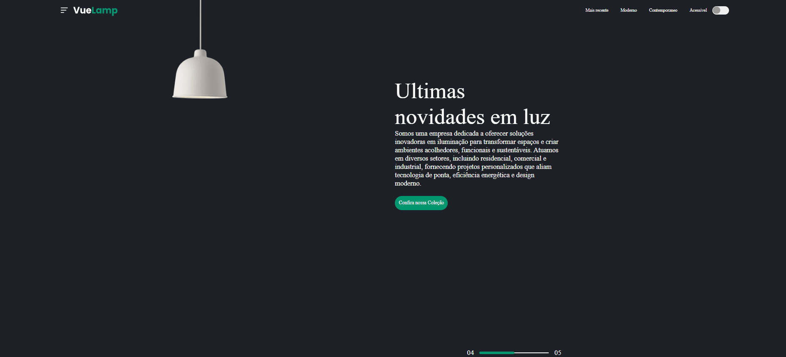

# VueLamp - Site de Iluminação Interativa


## Visão Geral
VueLamp é um projeto de website desenvolvido para uma empresa fictícia de iluminação, que oferece uma experiência interativa para os usuários. Neste projeto, os visitantes podem ligar a lâmpada exibida na tela ao clicar em um botão no canto superior direito. O site foi construído utilizando HTML, CSS e JavaScript para manipular a aparência e o comportamento da lâmpada, oferecendo um design elegante e intuitivo.

## Funcionalidades

- Interatividade: O usuário pode ligar a lâmpada clicando no botão de alternância no canto superior direito.

- Design Moderno: Estilo moderno com uma paleta de cores escuras e tipografia clara para uma aparência sofisticada.

- Responsividade (em andamento): Atualmente, o site não está completamente responsivo, mas há planos para adaptá-lo a dispositivos móveis.

## Tecnologias Utilizadas
- HTML5: Estrutura semântica da página.
- CSS3: Estilos visuais, incluindo layouts, cores e fontes.
- JavaScript: Interatividade para ligar e desligar a lâmpada.

## Como Funciona
A lâmpada é exibida como uma imagem SVG e seu estado é alterado ao clicar no botão de alternância. O código JavaScript detecta o clique e ajusta a classe da lâmpada, mudando seu estilo para simular o efeito de acender e apagar. Esta animação é realizada alterando as propriedades CSS da lâmpada.

## Como Executar o Projeto
1. Clone o Repositório
``` bash
git clone https://github.com/dorffdaniel/landing-page-luz
```
2. Abra o Arquivo `index.html` no Navegador: Navegue até a pasta do projeto e abra o arquivo `index.html` diretamente em seu navegador para visualizar o site.

## Inspiração
Este projeto foi criado com base em um tutorial do YouTube do canal GreatStack, que guiou o desenvolvimento do layout e da interatividade da lâmpada.

## Contato
Para mais informações, entre em contato via[linkedin](https://www.linkedin.com/in/daniel-alves-9872392a7/)
